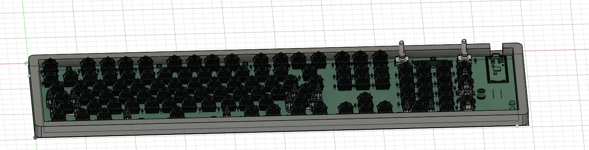
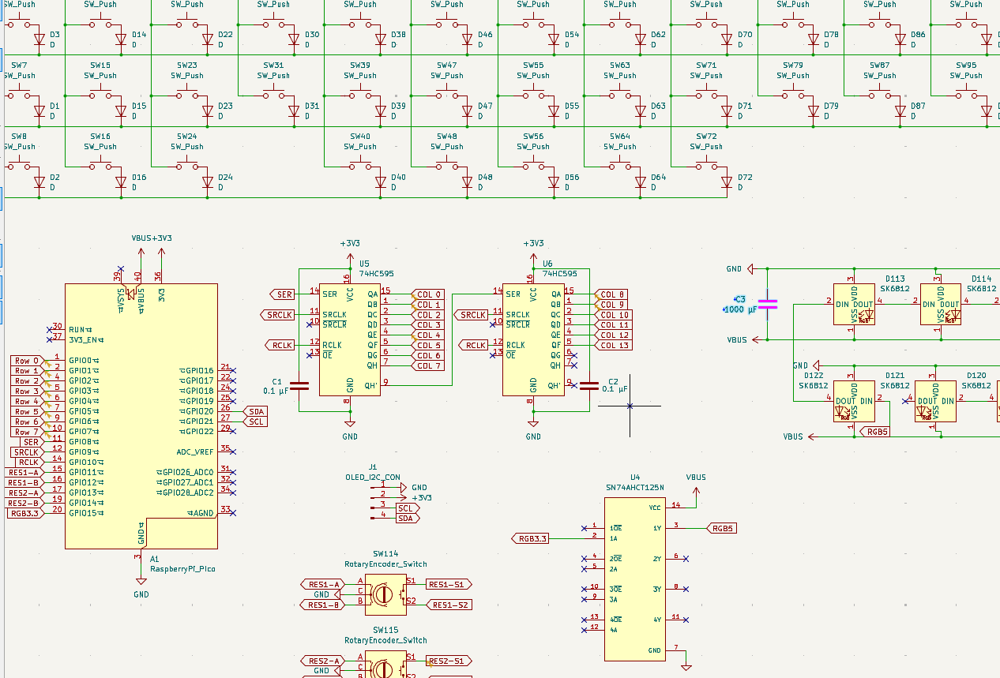
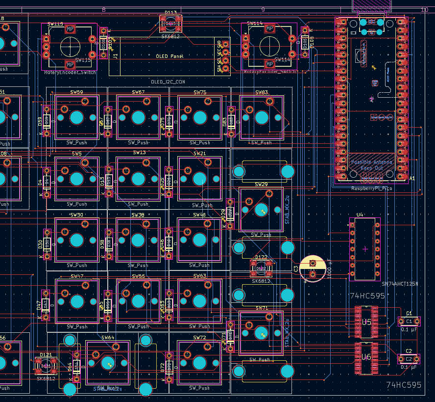
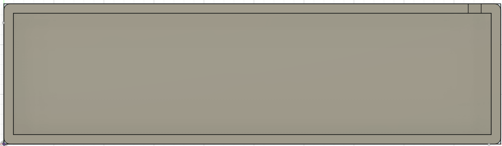

# George’s Keyboard

After many hours of work, I designed a custom mechanical keyboard featuring RGB LEDs, OLED displays, and rotary encoders. This project focuses on PCB planning, firmware research, CAD design, and represents my second hardware project ever.

---

## What This Project Is

This Project is a custom mechanical keyboard powered by a Raspberry Pi Pico. It has:
- Sections of addressable RGB LEDs
- Two rotary encoders with switches
- An OLED 0.91Inch display
- A custom PCB designed in KiCad
- A 3D-printed case that showcases the PCB

The goal of this project was to recreate my own keyboard layout while adding extra functionality and learning more about PCB design and KMK firmware.

---

## Inspiration

This was only my second project ever. While looking for ideas I realized that the inspiration was right in front of me: my own keyboard. After taking measurements and studying how keyboards in general are designed, I decided to recreate it while adding my own twist on the concept with LEDs, an OLED display, and rotary encoders.

---

## Challenges / What I Learned

This was the second PCB I havee ever designed, and the first one I designed completely on my own. Through this process, I learned:
- How to organize a KiCad project properly
- Better routing techniques
- How to recover from mistakes and reroute a board cleanly

Even though I had to redo parts of the design, the second iteration was much cleaner.

---

## Design Files

This project includes:
- A full keyboard schematic
- A routed PCB layout
- A 3D printable case design

Schematic | PCB Layout | Case
:--:|:--:|:--:
 |  |  

---

## Firmware (Planned)

The firmware is currently written but *untested*, as the keyboard has not yet been assembled. Once the hardware is built I plan to:
- Flash the firmware to the Raspberry Pi Pico
- Test all keys, LEDs, encoders, and the OLED display
- Fix bugs and upload a finalized version

After testing this section will be updated with corrected code and flashing instructions.

---

## Bill of Materials (BOM)

### Electronics
- 1× Raspberry Pi Pico
- 1× OLED module (0.91", 128×32)
- 2× Rotary encoders (12 mm, 24 P/R, with switch)
- 10× SK6812 RGB LEDs
- 2× 74HCT595D shift registers
- 1× 74AHCT125
- 110× 1N4148 diodes
- 1× 1000 µF capacitor
- 2× 100 nF ceramic capacitors

### Mechanical
- Keychron K Pro switches (110 pieces)
- Glorious Stabilizers V2
- Mountain Dolomite A Backlit Keycap Set
- 3D printed case (`case.stl`)

---

## Next Steps

- Wait for approval
- Order the PCB
- Print the case
- Assemble and solder all components
- Test and debug firmware
- Update this README with build instructions

---

## Reflection

This project helped me evolve a lot as a designer. Compared to my first PCB, this one is cleaner, more complex, and better planned. Even though it isn't built yet, I learned a huge amount about schematics, routing, and hardware design through the process.
